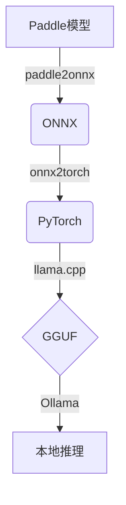

# Paddle2GGUF: Convert PaddlePaddle Models to GGUF Format

Paddle2GGUF 是一款便捷的工具，可用于将 PaddlePaddle 模型转换为 GGUF 格式。GGUF 格式是 LLM 模型的一种通用格式，可通过 Ollama 加载运行。

## 依赖

确保已安装以下依赖：

- paddle2onnx
- onnx2torch
- llama.cpp (仅需克隆仓库，无需安装)

## 使用方法

命令行运行:

``` shell

python convert.py --paddle_model_dir <paddle_model_dir> \
    --paddle_model_file <model_filename> \
    --paddle_params_file <params_filename> \
    --llama_cpp_dir <llama_cpp_directory>

```

## 参数说明

以下是命令行参数的详细说明：

| 参数                 | 是否必填 | 默认值     | 说明                                                       |
| -------------------- | -------- | ---------- | ---------------------------------------------------------- |
| --paddle_model_dir   | 是       | -          | Paddle 模型所在的目录                                      |
| --paddle_model_file  | 是       | -          | Paddle 模型文件名                                          |
| --paddle_params_file | 是       | -          | Paddle 模型参数文件名                                      |
| --onnx_save_path     | 否       | model.onnx | 保存 ONNX 模型的路径                                       |
| --torch_save_path    | 否       | model.pth  | 保存 PyTorch 模型的路径                                    |
| --gguf_save_path     | 否       | model.gguf | 保存 GGUF 模型的路径                                       |
| --llama_cpp_dir      | 是       | -          | llama.cpp 仓库的目录                                       |
| --opset_version      | 否       | 9          | ONNX 模型版本                                              |
| --outtype            | 否       | "f16"      | 模型输出格式（f32，f16，bf16，q8_0，tq1_0，tq2_0 或 auto） |

## 示例

假设你的 Paddle 模型目录为 ./paddle_model，模型文件名为 inference.pdmodel，参数文件名为 inference.pdiparams，且已克隆 llama.cpp 仓库到 ./llama.cpp：

``` shell

python convert.py --paddle_model_dir ./paddle_model \
    --paddle_model_file inference.pdmodel \
    --paddle_params_file inference.pdiparams \
    --llama_cpp_dir ./llama.cpp11

```

## 脚本功能

Paddle 模型转 ONNX：通过 paddle2onnx 工具将 Paddle 模型转换为 ONNX 格式。

ONNX 转 PyTorch：利用 onnx2torch 库将 ONNX 模型转换为 PyTorch 模型。

PyTorch 转 GGUF：使用 llama.cpp 工具中的 convert_hf_to_gguf.py 脚本将 PyTorch 模型转换为 GGUF 格式。

## 典型工作流



